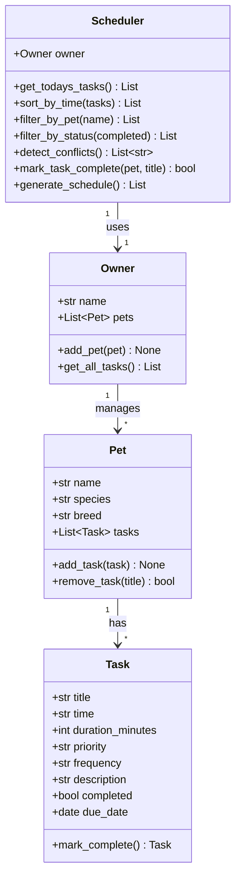

# PawPal+ 🐾

A smart pet care management system that helps owners keep their furry friends happy and healthy. PawPal+ tracks daily routines — feedings, walks, medications, and appointments — while using algorithmic logic to organise and prioritise tasks.

---

## Scenario

A busy pet owner needs help staying consistent with pet care. They want an assistant that can:

- Track pet care tasks (walks, feeding, meds, enrichment, grooming, etc.)
- Consider constraints (time available, priority, owner preferences)
- Produce a daily plan and explain why it chose that plan

---

## Features

### Core
- **Multi-pet management** — register any number of pets under a single owner profile.
- **Task scheduling** — assign tasks with a time, duration, priority, frequency, and due date.
- **Session persistence** — owner and pet data persist across Streamlit reruns via `st.session_state`.

### Smarter Scheduling
- **Priority-aware schedule generation** — `generate_schedule()` sorts by `high > medium > low` priority first, then by time-of-day, so the most important tasks always appear at the top.
- **Chronological sorting** — `sort_by_time()` returns tasks in HH:MM ascending order using Python's `sorted()` with a lambda key.
- **Pet and status filtering** — filter the task list by pet name or completion status (`pending` / `done`).
- **Recurring task automation** — marking a `daily` or `weekly` task complete automatically creates the next occurrence with `timedelta` arithmetic.
- **Conflict detection** — `detect_conflicts()` warns when two tasks for the same pet are scheduled at the exact same time, displaying the warning inline in the UI via `st.warning`.

---

## System Architecture (UML)



---

## Project Structure

```
pawpal_system.py   ← all backend classes (Task, Pet, Owner, Scheduler)
app.py             ← Streamlit UI
main.py            ← CLI demo / testing ground
tests/
  test_pawpal.py   ← automated pytest suite
reflection.md      ← design decisions and AI collaboration notes
requirements.txt
```

---

## Getting Started

### Setup

```bash
python -m venv .venv
source .venv/bin/activate       # Windows: .venv\Scripts\activate
pip install -r requirements.txt
```

### Run the CLI demo

```bash
python main.py
```

### Run the Streamlit app

```bash
streamlit run app.py
```

---

## Testing PawPal+

```bash
python -m pytest
```

The test suite covers 17 behaviours:

| Area | Tests |
|---|---|
| Task completion & recurrence | `mark_complete()` status, daily/weekly/once recurrence |
| Pet task management | add task, remove task, remove nonexistent |
| Owner aggregation | `get_all_tasks()`, `add_pet()` |
| Scheduler — sorting | chronological order correctness |
| Scheduler — filtering | by pet, by status |
| Scheduler — conflict detection | same-time conflict, no-conflict case |
| Scheduler — recurrence | `mark_task_complete` with auto-enqueue |
| Scheduler — schedule generation | priority ordering |

**Confidence level:** ★★★★☆ — all 17 tests pass. See `reflection.md` for known edge cases.

---

## 📸 Demo

*(Add a screenshot of your running Streamlit app here)*

---

## License

MIT
